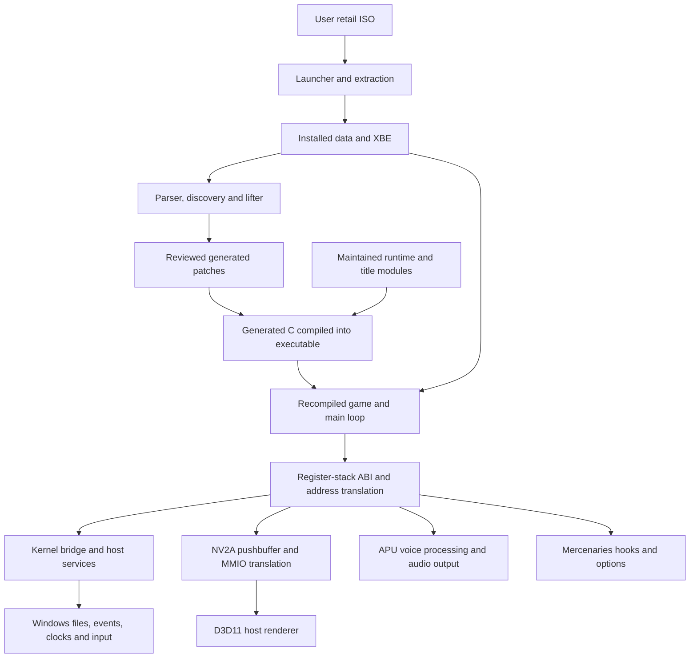

# Mercenaries Recompiled architecture

Documentation snapshot: 2026-09-29. This describes the inspected working tree, not every previously published executable. No production code was changed for this analysis.

Read this first, then [CODE_MAP](CODE_MAP.md) for navigation, [SUBSYSTEMS](SUBSYSTEMS.md) for interfaces/ownership, [DATA_FLOW](DATA_FLOW.md) for execution, [COMPATIBILITY](COMPATIBILITY.md) for fidelity boundaries, [WORKAROUNDS](WORKAROUNDS.md) before removing unusual code, and [MAINTENANCE](MAINTENANCE.md) before making changes. [ARCHITECTURE_EVIDENCE](ARCHITECTURE_EVIDENCE.md) records scope and historical reconciliation.

## Evidence convention

- **Verified from current implementation**: established from executable code/build rules inspected in this working tree.
- **Historically documented**: recorded in [SOL](DEV_HISTORY_SOL.md) or [ASTRA](DEV_HISTORY_ASTRA.md); not a fresh reproduction.
- **Derived**: a conclusion from inspected implementation, rather than an explicit contract.
- **Hypothesis**: plausible but not established.
- **Unknown**: evidence is insufficient.

Labels apply to the paragraph, table, or section they introduce. Historical explanations never override current implementation.

## Central design

**Verified from current implementation.** The product statically translates one supported Xbox Mercenaries executable into C and builds it into a native Windows executable. The guest game still supplies gameplay, scripts, resource management, and its main loop. Native compatibility code supplies the memory map, kernel services, input, graphics translation, audio hardware behavior, and selected title replacements. This is not a native source port of the whole game or a general-purpose Xbox CPU emulator.

Three artifacts must be distinguished:

1. Maintained source/toolchain: translator, runtime, title hooks, reviewed metadata, dependencies, build scripts, and tests.
2. Generated native program: disposable lifted C plus reviewed post-generation patches, compiled with the runtime.
3. Player installation: launcher, native game executable, supporting libraries, and separately extracted user game data. The ISO/XBE is an installation/regeneration input, not a source archive payload.

The supported XBE SHA-256 is `AA08EA21D952AC35F49C02C7E2ED08AA25AD7535FBBBCCC95636775F37BE99D7`. Address-based hooks and layout assumptions are tied to it. Accepting another executable requires more than bypassing its hash check.

## Components and boundaries

**Verified from current implementation.** [Root CMake](CMakeLists.txt) builds kernel, D3D, audio, APU, NV2A, and input libraries, with a platform dependency and an `xboxrecomp` interface target. [Port CMake](ports/mercenaries/CMakeLists.txt) links them with generated C and title modules. The installer is a separate executable.

| Layer | Responsibility | Boundary |
| --- | --- | --- |
| Offline translation | Decode instructions, discover functions, reconstruct control flow, emit C/dispatch tables | Fixes must survive regeneration. |
| Guest ABI | Preserve registers, stack effects, floating-point/SIMD state and indirect calls | Host C calling conventions do not express the guest ABI. |
| Guest memory | Back RAM, load sections, create aliases/synthetic kernel data | Guest addresses are neither host pointers nor resource identities. |
| Kernel bridge | Decode guest layouts/arguments, route imports, deliver callbacks | Host wrappers cannot independently decide guest callback timing. |
| GPU compatibility | Decode commands; translate resources, shaders and draws | RAM, host surfaces and scanout are separate state. |
| Audio compatibility | Voice/envelope/mixing behavior, MMIO/interrupts, PCM output | Cue lifecycle, notifications, hardware progress and sound differ. |
| Title integration | Narrow guest corrections and controls/options/mod/developer features | Depends on exact addresses, layouts, hashes and insertion sites. |
| Distribution | Extract/validate data and package permitted inputs/products | Workspace contents are not the source distribution policy. |

**Derived.** These are useful boundaries, not strict dependency isolation. PGRAPH calls a D3D8-shaped host interface; title code installs graphics/input callbacks; guest safe points service kernel work; implementation headers share manual-layer state.

## Initialization

**Verified from current implementation.** [main.c](ports/mercenaries/src/main.c), especially `WinMain`/`main` and `host_graphics_init`, establishes this sequence:

1. Register shader warmup callbacks before device creation. Resolve game/save roots and developer/logging settings; arrange exception handling and preview-log shutdown.
2. Read/validate the XBE. Initialize mod compatibility before choosing the memory configuration.
3. Create guest RAM/address mappings and copy XBE sections, including executable sections needed by guest byte walkers. Native compiled C executes the game instructions.
4. Initialize options, host window, D3D device, PGRAPH, internal/presentation resolution, controls and developer UI. Publish the guest address offset and initialize NV2A MMIO/VRAM integration.
5. Initialize APU/AC97, kernel services, paths and guest kernel bridge; install the host-service callback.
6. Start the host tick updater, set `g_esp` to the guest stack, configure selected diagnostics and call `xbe_entry_point`.

Initialization is not uniformly transactional: some failures log and continue; others exit. Inspect each failure branch before assuming all subsystems exist. Installer validation is separate from runtime startup.

The XBE loader deliberately leaves `.rdata` writable. In this retail image `.rdata` ends at `0x003B2454` and `.data` begins at `0x003B2360`, so both occupy page `0x003B2000`. Page-granular read-only protection would also protect the first part of writable `.data` and fault during initialization. A stale comment in `kernel_bridge.c` still says the thunk-table page is read-only; the memory-layout implementation is authoritative.

## Runtime execution

**Verified from current implementation.** The guest entry owns the long-running loop. Translated functions manipulate guest registers and memory. Direct calls can be compiled calls; indirect calls resolve guest addresses through manual/generated/kernel dispatch. Selected generated sites call title hooks.

There is no single host update loop advancing everything in order:

- Kernel calls and function checkpoints service eligible interrupts, timers, DPCs and host services.
- PFIFO PUT writes consume pushbuffer commands; PGRAPH draw/flip paths update surfaces and scanout.
- The host-service callback handles scanout, frame-slot waits, refresh and diagnostics.
- On each serviced display refresh, the host callback directly advances title-specific guest state at `0x00793564` and, when valid, the current device field at `*(0x00299378) + 0x1DE8`. These are supported-XBE layout dependencies, not generic Xbox APIs.
- APU workers process audio under a lock/condition protocol and latch interrupts for later guest delivery.
- Windows messages handle controls, developer actions, focus/window events and quitting.

`RECOMP_TRACE_RECENT` performs functional IRQ/timer/DPC work before optional tracing. Removing it as debug instrumentation changes execution.

## Shared state and concurrency

**Verified from current implementation.** `g_eax`, `g_ecx`, `g_edx`, `g_esp`, `g_ebx`, `g_esi`, `g_edi`, floating-point/SIMD state and `g_xbox_mem_offset` form process-global guest context. EBP handling also uses a local frame value and `g_seh_ebp`. Manual wrappers save/restore explicit contexts where required.

| State | Owner | Constraint |
| --- | --- | --- |
| Guest CPU context | Generated ABI/manual layer | Not a thread-local independently schedulable CPU. |
| Guest RAM/aliases | Memory-layout module | Outlives devices, callbacks and guest objects. |
| Pending IRQ/DPC/timers | Kernel bridge | Guest-safe delivery, IRQL/ISR guards. |
| PGRAPH/D3D caches | Renderer globals | Ordered mutable device state, not a concurrent renderer API. |
| APU state | APU core and locked workers | Workers do not directly execute guest callbacks. |
| Title continuation/allocation records | Manual layer | Synchronization is record-specific: the manual CRT heap uses an `SRWLOCK`; many continuation/diagnostic records still assume guest-thread execution. |
| Options/input/developer requests | Title/window/input modules | Raw input has explicit accumulation; other records depend on call context. |
| Tick/logging | Dedicated host services | Synchronization separate from guest scheduling. |

**Derived.** Parallelizing lifted functions would be an architectural change. The bridge `PsCreateSystemThreadEx` path invokes guest routines synchronously with startup/saved-context conventions; lower kernel code also contains native thread wrappers. These are different paths.

The supplementary DirectSound software mixer is a separate global subsystem in `apu_core.c`, not part of `MCPXAPUState`. Only slot allocation/free are protected by its critical section; borrowed voice pointers, play/stop, render, and `DSoundBuffer::SetBufferData` updates are not consistently synchronized. This is a current implementation hazard, not an intended concurrency guarantee.

## Shutdown and process lifetime

**Verified from current implementation.** If the guest returns normally, main shuts down PGRAPH, releases the device, destroys the window, shuts down audio, stops/joins the tick thread, shuts down the kernel, unmaps guest memory and frees the loaded XBE. Audio joins its workers before freeing state.

APU initialization requests a 1 ms Windows multimedia timer period because late 5.333 ms audio batches slow the XGSCNT/movie clock; normal APU shutdown balances it with `timeEndPeriod(1)`. The global supplementary mixer, however, has no symmetric reset/critical-section teardown and strengthens the one-game-per-process assumption.

Closing the window differs: the graphics message pump handles `WM_QUIT` with `ExitProcess(0)`, bypassing normal return/unwind. Some registrations/caches retain process-lifetime data; NV2A MMIO initialization has no symmetric public shutdown API. Kernel shutdown does not sweep every open host object.

**Derived.** One game per process is the practical lifetime model. Reinitialization, repeated in-process instances, complete rollback of partial startup and library embedding are not established contracts.

## Platform boundary

**Verified from current implementation.** The main product path is Windows x64/MSVC, D3D11/DXGI, Windows file/event APIs, XInput/SDL controllers, and XAudio2 with waveOut fallback. The large host stack is distinct from the emulated guest stack. Wine/Proton runs this Windows product; its shader compiler wrapper selects a bundled native compiler there.

POSIX/SDL/OpenGL and Win32-compatibility branches exist, but MMIO/audio paths include inactive non-Windows implementations. Native POSIX parity is not established by the presence of these files. It is a different claim from Windows-under-Wine support.

## Maintenance assessment

**Derived.** Guest addresses, flags, shared epilogues, GPU ordering, surface aliases and audio interrupt timing are necessary compatibility complexity. Maintenance debt concentrates in implicit ownership across large files, sequential generated-text patching, repeated layout assumptions, diagnostics mixed with functional hooks, process-lifetime cleanup and tests coupled to source spelling.

Make contracts explicit and testable before changing boundaries. The snapshot still has unresolved automated failures and visual/audio questions. Functional completeness does not establish complete compatibility.
