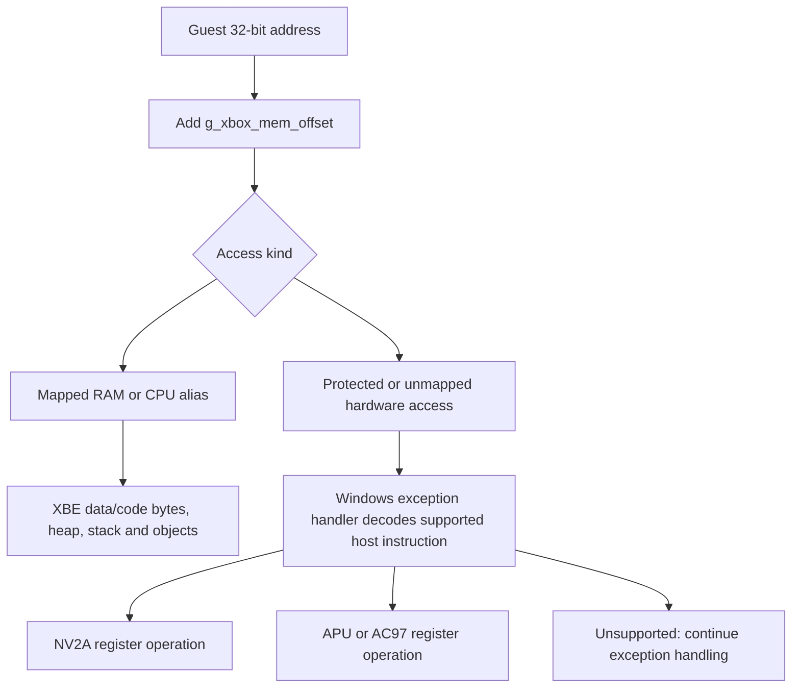
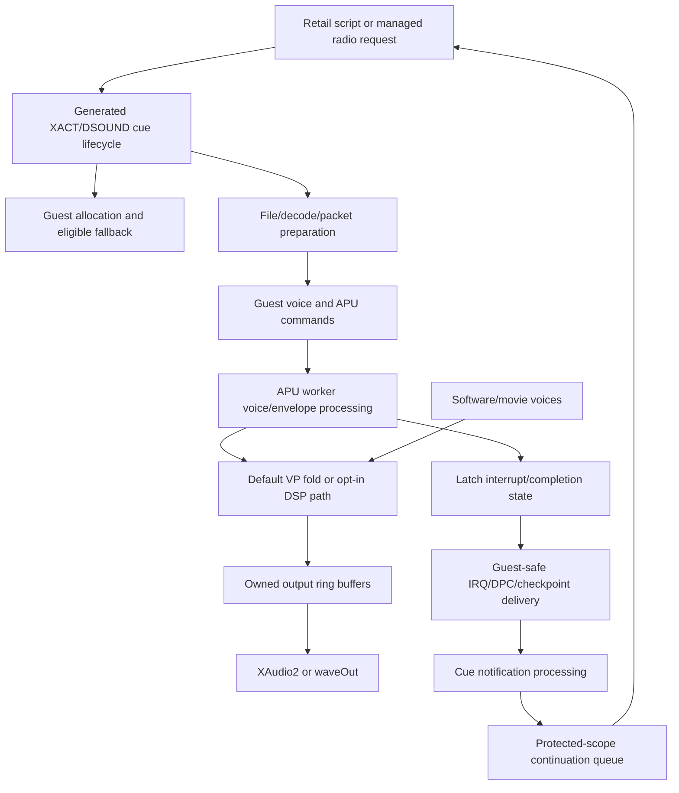
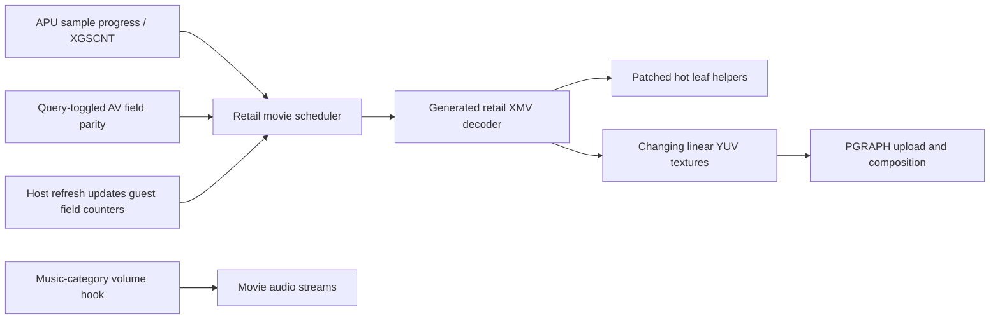
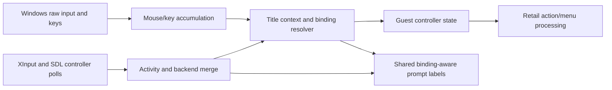

# Execution and data flow

Snapshot: 2026-09-29. Paths below are **Verified from current implementation** unless marked otherwise. These are representative complete boundary traces, not an assertion that every guest call follows one route. Read [SUBSYSTEMS](SUBSYSTEMS.md) for ownership and [WORKAROUNDS](WORKAROUNDS.md) for reasons behind ordering constraints.

## 1. Retail input to executable to installation

```mermaid
flowchart LR
    ISO[User ISO] --> Extract[Extract and validate]
    Extract --> XBE[Supported XBE and data]
    XBE --> Parse[Parse and disassemble]
    Parse --> Discover[Iterative function discovery]
    Discover --> Lift[Lift with reviewed ranges]
    Lift --> Patch[Apply generated patches]
    Patch --> Build[Compile and link runtime plus title]
    Build --> Validate[Build-specific validation evidence]
    Validate --> Package[Hash-checked player package]
    Package --> Launcher[Player launcher]
    ISO --> Launcher
    Launcher --> Installed[Locally installed data]
```



[Recompile.ps1](ports/mercenaries/scripts/Recompile.ps1) iterates discovery/seed merging until ordered seed content stabilizes or the pass limit is reached. The reviewed function-owner ranges preserve shared frames; manual entries identify replacements. Existing generated output is archived before replacement. The patch stage is behaviorally significant and can partially write before a later failure.

[Package-Preview.py](ports/mercenaries/scripts/Package-Preview.py) requires the built game hash to equal the validation JSON's runtime hash. It checks provenance archive hashes/CRC, source-package policy, explicit payload members, staged ZIP member hashes, clean launcher validation and extractor startup before renaming the partial package. Gameplay evidence is supplied to the packager, not generated by its smoke checks.

The player launcher performs its own extraction into a staging directory under an installation lock. Full staging validation precedes the completion marker and activation. Normal later launch takes the marker shortcut. Game data, saves, gameplay settings and maintained source have different inclusion policies; the normal player ZIP does not bundle the user's ISO or extracted game.

## 2. Runtime startup and failure paths

```mermaid
sequenceDiagram
    participant Main as main.c
    participant Mem as Guest memory
    participant Gfx as Host graphics/PGRAPH
    participant HW as NV2A/APU/AC97
    participant K as Kernel bridge
    participant Guest as Generated game
    Main->>Main: Register warmup; resolve roots/settings; install VEH; read/hash XBE
    Main->>Mem: Choose mod memory and create/load mappings
    Main->>Gfx: Options, window, device, PGRAPH, controls
    Main->>HW: Publish guest offset; initialize NV2A MMIO, APU and AC97
    Main->>K: Kernel/path/bridge init and service callback
    Main->>Main: Start tick updater; set guest stack
    Main->>Guest: xbe_entry_point()
    Guest->>K: Imports and safe-point service during guest loop
    Guest-->>Main: Optional normal return
    Main->>Gfx: PGRAPH shutdown, device release, destroy window
    Main->>HW: Stop/join audio work
    Main->>Main: Stop/join tick thread
    Main->>K: Kernel shutdown
    Main->>Mem: Unmap/close backing
```

This depicts normal completion, not guaranteed unwinding. Initialization has both fatal and log-and-continue branches. Window close leads through WM_DESTROY/WM_QUIT to `ExitProcess` in the graphics message pump and bypasses this normal return chain. The exception handler is registered during startup and uses published memory/hardware state; it is not an independent emulator process.

## 3. Lifted function to kernel/host service

```mermaid
sequenceDiagram
    participant G as Generated function
    participant ABI as recomp_types.h
    participant B as kernel_bridge.c
    participant W as Lower kernel wrapper
    participant OS as Host API
    G->>ABI: Guest target plus register/stack arguments
    ABI->>ABI: Resolve manual/generated/kernel and preserve required state
    ABI->>B: Kernel dispatcher for thunk target
    B->>B: Service eligible pending work; decode ordinal/layouts
    B->>W: Native arguments and translated pointers/handles
    W->>OS: Host operation
    OS-->>W: Native result
    W-->>B: Status and output
    B->>B: Convert outputs, set guest result, clean guest arguments
    B-->>G: Return through guest ABI
```

For `NtReadFile`, the bridge translates guest file/event/buffer/status representations; lower file code performs synchronous host read/cache work, then guest completion/APC delivery follows bridge rules. Eligible read-cache refills hold one global cache critical section across `ReadFile`, so separate cached handles can serialize. A host `ReadFile` call with an offset structure does not by itself establish arbitrary asynchronous buffer ownership.

An indirect guest function can instead hit a manual implementation or another generated function without entering the kernel. Tail calls must not fabricate an extra guest return address. The bridge startup path uses a different lookup preference from general ICALL; preserve it until intentionally changed with tests.

## 4. Guest address to storage or MMIO



RAM aliases share backing while their virtual mapping records remain distinct. The GPU aperture is separately established. A raw guest address does not imply that the entire host range is mapped, and pointer arithmetic must preserve 32-bit guest semantics. Explicit bridge null conversion and raw memory macros have different contracts.

Allocation flow is also domain-specific: ordinary title allocation first; only eligible Lua/audio failures enter main-pool fallback with an ownership record. Free/realloc checks that record. Optional graphics and permanent-property capacities are not interchangeable with this fallback.

## 5. Guest rendering to presentation

```mermaid
sequenceDiagram
    participant Game as Recompiled retail graphics
    participant FIFO as NV2A PFIFO
    participant PG as PGRAPH
    participant Host as D3D11 adapter
    participant Present as Scanout/frame service
    Game->>FIFO: Pushbuffer in RAM; update PUT
    FIFO->>FIFO: Decode method/jump/call/inline data
    FIFO->>PG: Ordered method/state/draw operations
    PG->>PG: Resolve surfaces, uploads, aliases, shaders and state
    PG->>Host: Bind resources and issue host draw/copy
    Game->>PG: Flip/FLIP_STALL methods
    PG->>Present: Pending scanout and deferred/resolve ordering
    Present->>Host: Present eligible completed output
    Present->>Present: Frame-slot pacing and display refresh service
```

PFIFO processing is synchronous to the relevant register operation; host presentation is not equivalent to guest game-loop advancement. Main's host-service callback calls scanout service, waits for a guest frame slot when appropriate and services display refresh. On a serviced refresh it also increments guest counter `0x00793564` and conditionally brings `*(0x00299378) + 0x1DE8` forward to that count. Those writes are title-layout hooks, not generic renderer state. Refresh logic does not manufacture a new frame by repeatedly presenting discarded old contents.

Resources cross representations: guest bytes identify textures/surfaces; host textures/views cache their current interpretation; shader translators turn guest state into HLSL; bytecode cache avoids repeated compilation; device objects still require creation. CPU writes and explicit copies can invalidate an earlier cached interpretation. A draw-dependent workaround must preserve all later state, including geometry shaders and texture-stage changes.

CPU/movie presentation has a separate source-buffer path: validate dimensions/pitch, convert as needed, upload to a source-sized texture, then copy/scale to output. This avoids destination-sized out-of-bounds reads. Rendered-world aspect, HUD canvas aspect and final output aspect are separate transforms.

## 6. Cue to audible output, and completion back to script



This is not a single synchronous Play-to-speaker call. Success at each boundary proves only that stage: allocation, stream readiness, hardware progress, nonzero PCM, device queueing, terminal cue state and script notification can fail separately.

Hardware processing is gated by SECTL state. The worker processes 32-sample units, forming 256-sample output blocks. The monitor copies data into its own rings before submitting to a device. A PCM owner cannot free borrowed memory merely because a host call returned.

STOP intent recovery is an exceptional branch from cue notification setup: retain a descriptor when subscription allocation fails; later verify terminal cue, child-list and wrapper/handle/bank identity; then write the ordinary notification. It does not directly call the HQ success path or complete after a fixed silence timeout.

## 7. Movie/XMV cadence across subsystems



XMV is not a standalone host codec. Most decode logic remains generated guest code; `xmv_fast_helpers.h` replaces high-frequency leaf operations. The scheduler observes APU sample progress and AV field behavior, while PGRAPH sees changing linear textures. APU initialization requests `timeBeginPeriod(1)` on Windows because coarse wakes made 5.333 ms batches late and the audio-mastered movie clock slow. The host display callback's guest vblank/device-field writes are another title-specific input. These clocks must not be collapsed into the FPS cap or wall-clock parity.

Movie checkpoints in the manual layer are largely diagnostic; their presence alone does not make them functional dependencies. The hot helpers, volume hook, APU timing request, AV field behavior, guest counter writes and renderer path are current functional behavior.

## 8. HQ failure recovery boundaries

There are at least three distinct paths:

1. **Exterior guard remains locked:** investigate registered PreBriefing wait, cue state, STOP subscription/notification and deferred continuation. The screen has not necessarily entered an HQ scene.
2. **Interior black screen while movement continues:** investigate failed Lua scene construction/continuation and exact EnterBriefing ownership. Recovery requires scoped error evidence and performs authored exit plus chair/camera cleanup.
3. **Native crash around HQ entry:** inspect pointer/object lifetime and prepared cue retirement. A crash stack without captured guest memory cannot prove the original corrupting write.

Allocation fallback can prevent some earlier failures in either dialogue or script construction. Error recovery remains a separate safety path. Historical complaints from an old build do not prove recurrence in a newer executable; use runtime hashes and contemporaneous logs.

## 9. Input event to guest action and prompt



Controller activity is observed before title mapping. A device's presence does not permanently force controller prompts. Keyboard fallback can supply slot-zero state without a pad. Context depends on actual gameplay/menu state, including the HVT screen whose default joy context originally bypassed menu confirmation.

Rebinding is another state machine: capture initial held inputs, release-gate those inputs individually, accept a new eligible key/button/axis and preserve cancel. Saving defaults versus an existing profile follows separate rules. Video/options apply writes do not own user binding reset.

## 10. Resource creation/destruction examples

| Resource | Creation/owner | Consumers | Destruction/lifetime boundary |
| --- | --- | --- | --- |
| Guest RAM mapping | Layout initialization | All generated code, device backends and title hooks | Normal shutdown after workers/devices; separate aperture ownership must be considered. |
| Fallback title block | Manual allocation through guest main pool, plus host record | Lua or approved XMem consumer | Ownership-aware free/realloc; never ordinary free blindly. |
| Host surface/texture | PGRAPH/D3D conversion/cache | Draw, copy, sampling, scanout | Cache replacement/PGRAPH/device release; validity differs from guest address lifetime. |
| Optional registered pixels | Title content module with stable data | External renderer registration | Often process lifetime; registration cleanup does not imply pixel-owner cleanup. |
| DirectSound buffer PCM | DSoundBuffer allocation/refcount | Global software mixer borrows it | Final release stops/frees the slot first. `SetBufferData` currently violates the equivalent synchronization requirement and can race render or leave a dangling pointer on allocation failure. |
| Continuation name | Voice queue copies text | Later guest callback dispatch | Unlink before dispatch; free/cancel by matching scope/owner. |
| Host file | Kernel file open and bridge association | Read/cache/APC paths | Cache/directory cleanup and handle close; guest completion ordering still matters. |
| Boid actor | Guest-safe developer spawn | Guest renderer/animation and host flock model | Guest lifecycle invalidation/reset; no automatic respawn after reload/province change. |

## 11. Thread and clock interactions

The main guest context is global. APU hardware workers use locks/conditions; the tick updater uses stop/join control; logging has a bounded producer/consumer mechanism. The supplementary DirectSound mixer is global and only allocation/free are consistently under its critical section; borrowed voice mutation/play/stop/render are not a thread-safe API. None authorizes concurrent execution of arbitrary guest functions. Bridge thread startup adapts guest expectations synchronously; native thread wrappers elsewhere are a separate facility.

There are several clocks: host QPC, guest 3000-unit game time, separately modeled vblank, APU sample time and presentation deadlines. Fractional carry repairs a selected guest delta path; an FPS cap schedules frame opportunities. Neither alone proves all physics correct at arbitrary rates. Developer free-camera time controls also affect selected title time behavior, not the audio hardware clock as a whole.
